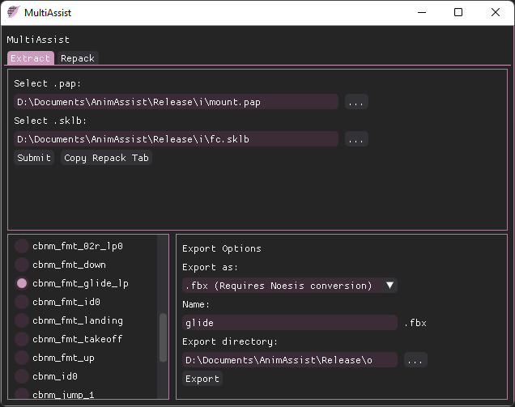
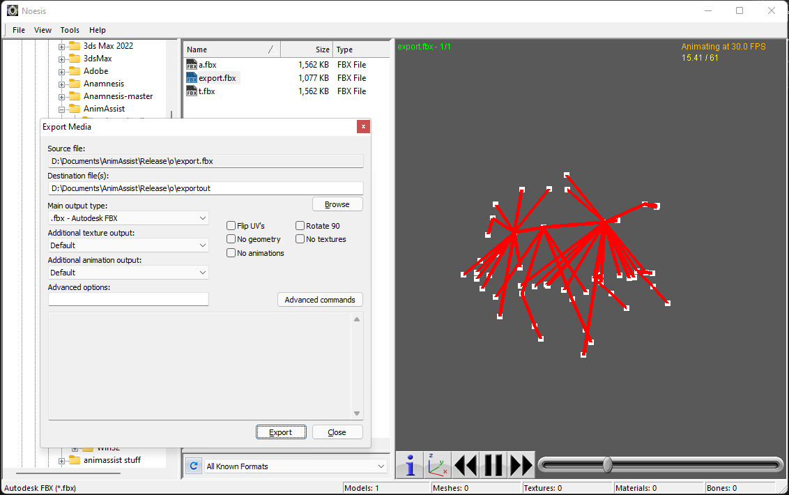
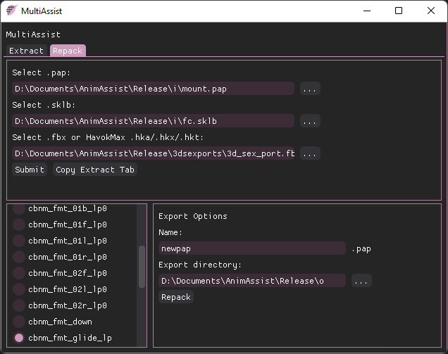

# MultiAssist
[AnimAssist](https://github.com/lmcintyre/AnimAssist) GUI with support for repacking .pap files with multiple animations, minor bug fixes, and more extensive export options, including FBX. It can also be used without the GUI through command line arguments. 

This project assists in the editing of FFXIV animation files. 

I started this fork so I had a quick way to extract some animation data from XIV that AnimAssist itself did not provide by default, I expanded upon it until it became MultiAssist. The multi-animation repacking process seems to be an enigma to many due to some unfortunate things, hopefully this makes it more accessible. 

Essentially everything good in this project comes from Perchbird's work, everything bad in this project is probably by me. 

# Table of Contents
- [Pre-requisites](#pre-requisites)
    + [Required software](#required-software)
    + [Recommended software](#recommended-software)
    + [Optional Software](#optional-software)
- [Installation and Usage](#installation-and-usage)
  * [Installation](#installation)
  * [Extracting an animation](#extracting-an-animation)
  * [Editing your exported animation](#editing-your-exported-animation)
  * [Repacking your edited animation](#repacking-your-edited-animation)
  * [Getting your edited animation back into FFXIV](#getting-your-edited-animation-back-into-ffxiv)
- [Command Line Usage](#optional-command-line-usage)
- [Technical rundown of the process](#technical-rundown-of-the-process)
- [Future development plans for MultiAssist](#future-development-plans-for-multiassist)
- [Building, contributions, and notes](#building-contributions-notes)

# Pre-requisites
### Required software
* The latest release in [Releases](https://github.com/ilmheg/MultiAssist/releases) (or your own build of the project).
* [VC++2012 32-bit Redist](https://www.microsoft.com/en-us/download/details.aspx?id=30679#)
    * Select "VSU_4\vcredist_x86.exe" when choosing which file to download.
    * This is required for Havok stuff, please install it.
* [animassist.exe/tofbx.exe/fbx2havok.exe and associated libraries](#)
    * **These are already included in the release download.** 
    * If you wish to view their source or to build them yourself, refer to:
        * animassist.exe was built from the C++ project in this repository, you **must** use this version of animassist.exe and cannot use the executable from the original project. Refer to [Building](#building) for build requirements.
        * [tofbx](https://github.com/lmcintyre/fbx2havok) (or a renamed [havok2fbx](https://github.com/razar51/havok2fbx))
        * [fbx2havok](https://github.com/lmcintyre/fbx2havok) (The build in this project is slightly modified to output uncompressed animations)

### Recommended software
* [FFXIV Explorer (goat fork)](https://github.com/goaaats/ffxiv-explorer-fork)
    * Convenient way to browse and extract Skeleton and Animation files. Please use raw extraction (Ctrl+Shift+E) for MultiAssist purposes. Other methods of extractions, such as TexTools, will also work.
* [Noesis](https://richwhitehouse.com/index.php?content=inc_projects.php&showproject=91)
    * Use this to convert FBX file exported from MultiAssist to binary FBX files. Please use this converted FBX file when importing into 3D software, rather than the export directly from MultiAssist.
    * Unconverted FBX files can still be imported into some 3D editors, however they will likely not import as expected.
    * Consider FBX repacking to be in an unpolished state, I would appreciate oddities being reported, as testing this stuff is really monotonous.
* (**Recommended if you have 3DS Max**) [HavokMax - 3DS Max plugin](https://github.com/PredatorCZ/HavokMax/)
    * HavokMax adds the functionality to import and export .hkx packfiles through 3DS max.
    * You do not need this if you plan to edit .FBX files. If you wish to edit .FBX files, please refer to Noesis in the [Recommended Software](#recommended-software) section.
* A 3D editor
    * To edit the extracted animations.
    * I only tested with 3DS max. 
### Optional Software
* Python 3 (If running from MultiAsisst.py rather than the pre-built release)
    * I was using python 3.10.4
    * BeautifulSoup: `pip install bs4` in terminal/command line.
    * Dear PyGui: `pip install dearpygui`  in terminal/command line.
    * If you are using the .py, make sure to build or otherwise acquire the companion executables.
* [Godbert](https://github.com/xivapi/SaintCoinach#godbert)
    * May be useful in assisting yourself in familiarizing yourself with the location of FFXIV animations, entirely optional.

# Installation and Usage
*(NOTE: UX, input validation and error reporting within the GUI is quite poor within the current release! Please follow these instructions carefully and with this in mind. For now, a command window should open alongside the MultiAssist executable which should provide insight into any errors you run into, as well as a way to track the progress of any operations you perform.)*
## Installation
To install MultiAssist, head to [Releases](https://github.com/ilmheg/MultiAssist/releases) and download the latest MultiAssist.zip. Extract the files to an accessible location and run MultiAssist.exe to use the GUI. Do not remove any of the extracted files in this folder.

The MultiAssist GUI might open under the terminal window. 

## Extracting an animation

### Extracting raw animation and skeleton files from XIV
For demonstration purposes, we will use FFXIV Explorer to export our animations and skeleton files. If it's your first time using FFXIV Explorer, make sure your FFXIV Path is set in Options > Settings > FFXIV Path.

Most animations you will want to edit are located in 040000.win32.index, to open this in FFXIV Explorer navigate to File > Open and select 040000.win32.index.

The contents of this index file are divided into folders such as chara/human and chara/monster. Skeletons will generally be located at `chara/{category}/{type_char}{id}/skeleton/base/b0001/skl_{type_char}{id}b0001.sklb`.

For a quick reference on the different human folders, take a look at this table.

| Race/Gender       | Folder               | Notes  |
| ------------------|----------------------| -------|
| Hyur Midlander M  | chara/human/c0101/   | A lot of emotes use the Hyur male skeleton
| Hyur Midlander F  | chara/human/c0201/   |     
| Hyur Highlander M | chara/human/c0301/   |  
| Hyur Highlander F | chara/human/c0401/   |
| Elezen M          | chara/human/c0501/   |
| Elezen F          | chara/human/c0601/   |
| Miqote M          | chara/human/c0701/   |
| Miqote F          | chara/human/c0801/   |
| Roegadyn M        | chara/human/c0901/   |
| Roegadyn F        | chara/human/c1001/   |
| Lalafell M        | chara/human/c1101/   |
| Lalafell F        | chara/human/c1201/   |
| Au Ra M           | chara/human/c1301/   |
| Au Ra F           | chara/human/c1401/   |
| Hrothgar M        | chara/human/c1501/   |
| Hrothgar F        |                      | c1601 (probably)      
| Viera M           | chara/human/c1701/   |
| Viera F           | chara/human/c1801/   |

Animation files always have the `.pap` extension. It can sometimes be difficult to determine which skeleton an animation uses. MultiAssist will warn you if there is a mismatch between the skeleton and the skeleton the animation file was built with. Animation files will usually be nested within an  `/animation/` folder. Emotes will generally further be within a `bt_common` folder, for example `chara/human/c0101/animation/bt_common/emote` for most Male Hyur emotes.

Finding non-human files is broader topic, however, searching for a mount/minion/etc. in TextTools will provide you with an id within its material/model paths that should provide sufficient information. If Fatter Cat's material path is `chara/monster/m0512/obj/body/b0001/texture/v01_m0512b0001_d.tex` you would knonw Fatter Cat related files will be under `chara/monster/m0512/`, for example.

For this demonstration, I will be exporting the Fatter Cat skeleton and animation file. The basic animations for a mount are stored within a `mount.pap`. To grab this file, navigate to and select `chara/monster/m0512/animation/a0001/bt_common/resident/mount.pap` in FFXIV explorer. With it selected, select File > Extract Raw (Or press Ctrl+Shift+E) and select your save directory. It is essential that you extract this file as a raw file.

The skeleton for Fatter Cat is listed under `chara/monster/m0512/skeleton/base/b0001/skl_m0512b0001.sklb`. We just need the .sklb file, so select it and extract the raw file again.

With both the .sklb skeleton file and .pap animation file extracted we can move to MultiAssist. You may wish to move the files to a more convenient location. Note that the .pap and .sklb files will be nested within the same folder layout as described in FFXIV Explorer after extracting.

### Exporting editable animation files with MultiAssist
After extracting our animation and skeleton file, we can finally open `MultiAssist.exe` to extract an editable animation file.

With the Extract tab selected, we first should select our .pap and .sklb files. You can select these with the in-app file explorer by pressing \[...\] or by typing in a path manually.

With the paths to the respective files set, press \[Submit\] to populate the animations list in the lower left corner. If your .pap only has one animation in it, only a single animation with be displayed here, otherwise, select the animation you wish to extract. If you change the .pap file at any point, make sure to press submit once again.

The export options in the lower right corner allow you to select the file type and path of your exported animation file. I'll select .fbx and name my animation file export. Select your export directory and and press \[Export\] to begin exporting the file. This should be a very quick process. 

Please make sure you have everything correctly inputted before pressing \[Export\]. If successful, there will be a success dialog displaying the export directory.

## Editing your exported animation
### FBX
#### ***NOTE ON FBX SUPPORT:*** 
*fbx2havok is an older proof-of-concept project by Perchbird, provided mostly as is. This executable in this release is modified to output uncompressed animations, rather than the compressed animation of the original, it is otherwise the original project. **As far as I can tell, this is enough to prevent fbx2havok from being a glitchy mess.** I'm not confident things such as no. of frames is properly preserved, however. If something goes wrong, keep the unpolished nature of this in mind. I would like to see this method fleshed out, and thus am interested in any errors you encounter using this method.*

To get started editing this FBX, we must first convert it into a binary .FBX file through [Noesis](https://richwhitehouse.com/index.php?content=inc_projects.php&showproject=91). While you can import the unconverted FBX file into some 3D editors, it'll likely display and export as a broken animation.

Within Noesis, navigate to your export folder in the file tree on the left pane. Your exported .fbx will appear in the middle pane. Selecting it will allow you to preview the animation on the right-most pane. Right-selecting it will allow you to export the .fbx to .fbx. Use the settings in the screenshot below:

When exported, the file should be called `<file_name>.rda.fbx`.

The exported file can be imported into your 3D editor of choice. Make sure you import the right one, if you are using 3DS max you should see `Animation Take: Noesis Frames` when importing. The default import settings should be correct. 

After making edits to your animation, it should again be exported as an .fbx file before beginning the repacking process.

### HKX (Packfile) \[HavokMax\]

From the [AnimAssist README.md](https://github.com/lmcintyre/AnimAssist/blob/main/README.md)
> Open 3DS Max and check the Plug-in Manager to ensure HavokMax is properly installed.

> From the Max menu, click Import and select your output_file.hkx from the previous step to open it in 3DS Max. Select disable scale, invert top, and set Back: Top. Click import, and you'll get a wonderful fistbumping skeleton, read directly from what was once game files.

> You have some sweet changes to some animation, but now we need to put it back into the game.

> From the Max menu, click Export and type any filename you want, and save it in a cool, dry place. In the "Save as type" drop-down, select "Havok Export (*.HKA, *.HKX, *.,HKT)". We will be saving an hkx file once more. Export your file, again, selecting disable scale, invert top, and set Back: Top. You must select those, as well as Export animation and include skeleton. Set toolset to 2014. In my testing, I found that it was optional, however, it seems safest to disable optimize tracks according to user reports.

### Other export formats (havok binary tagfile and XML)
Not properly implemented yet. The XML file will contain all animations if more than one is present.
These probably aren't super useful. Both files (and the .hkx packfile) can be opened in Havok Standalone Tools, and probably not much else. I consider the xml file useful for debugging. At the current time, these two formats cannot be repacked into a .pap with MultiAssist.

## Repacking your edited animation
With an edited and exported .fbx or .hkx, repackaging the animation is simple.

As with the extraction process, select your .pap and .sklb file. These should be the same, unedited files your used to extract the animation from. You may re-extract these files from FFXIV if you have lost them. 

Select your edited .fbx or HavokMax export, and press submit to populate the animation list. You should select the animation you want to replace. This can technically be any animation, but generally you will want to replace the same animation you extracted.

Enter a name and export directory into the Export options and press \[Repack\]. As always, make sure you fill out every field before pressing \[Repack\].

### Getting your edited animation back into FFXIV
The resulting .pap file can be imported into FFXIV through TexTools by using the raw file operations (Tools > Raw File Operations > Import Raw File), leaving Decompressed Type 2 Data checked, or by placing it in the right place in penumbra.

The destination you will be importing your .pap into will generally be the same as the location you extracted it from. Include the file name and extension, and make sure you use forward slashes ("/") when entering your destination path.

For the Fatter Cat, in TexTools you would enter `chara/monster/m0512/animation/a0001/bt_common/resident/mount.pap` as the destination, then press \[Import File\] to select your new .pap file. It doesn't matter what your new .pap file is named, as long as it is imported to the right place.

If the game loads the animation fine, it's successful! If it crashes or otherwise, something probably went wrong, either while editing the animation or within AnimAssist.

# (Optional) Command Line Usage
This project maintains the command line functionality of AnimAssist, both within animassist.exe and MultiAssist.exe. Using command line arguments will not initialize the GUI and at this point probably has better error reporting than the GUI. Here's a basic rundown of the commands, refer to the above Usage for further information.

### Extracting
`multiasisst.exe extract -s original_skeleton_file.sklb -p original_pap_file.pap -a modified_animation.hkx -i <animation index> -o new_ffxiv_animation.pap -t <file type>`

where `<file type>` is one of:   
* fbx
* hkxp
* hkxt
* xml
### Repacking
`multiasisst.exe pack -s original_skeleton_file.sklb -p original_pap_file.pap -a modified_animation -i <index to replace> -o new_ffxiv_animation.pap`

Futhermore, you can use the original AnimAssist commands with `aextract` and `apack` and the respective original arguments. Please note the original commands do not support multi-pap repacking, but do retain some minor fixes in the extraction process.

# Technical rundown of the process
### Extraction
#### MultiAssist.py
1. Strips headers of pap and sklb, leaving us with a havok binary tagfile of the animation and skeleton.
#### animassist.exe
2. Creates XML packfile of Skeleton from the havok tagfile.
3. Selects the animation and binding of the specified index and repackages them with the Skeleton packfile into a new havok packfile.
#### MultiAssist.py
4. Output differs depending on file type input.
    * FBX - Runs havok data through havok2fbx.exe and returns an FBX.
    * Packfile - Returns the packfile from step 3.
    * Tagfile - Returns the havok anim data from step 1.
    * XML - Uses animassist.exe and the havok data from step 1 to return an XML file with the same format as Havok Preview Tool exports.

### Repackaging
In short, the files end up as the XML export format discussed in the final step of extraction. From this, the animation and binding of the modded animation replace the animation and binding of the user inputted animation index. The merged XML is passed back to animassist.exe where it is converted into a binary tagfile. The header is regenerated with new offsets and the timeline data is copied from the original .pap into the new export.

Using 

# Future development plans for MultiAssist
I hope to continue supporting this project. In the near future I will improve input validation and error reporting within the GUI. Additionally, I am looking for ways to further streamline the process in the more distant future, such exporting directly to penumbra. Less generally, I believe direct animation swapping and features of a similar vein are also within the scope of this project.

# Building, contributions, notes
## Notes
Please note I nor this project are affiliated with AnimAssist, fbx2havok, havok2fbx, or any other projects, nor their contributors.

In the spirit of the original AnimAssist, this project's license if WTFPL. Refer to the LICENSE within the release folder for the license of the included redistributed executables.

I hope this program further streamlines animation editing in FFXIV and makes the process more accessible. 

Lastly, please note I *really* don't know what I'm doing!!

## Building
Building animassist.exe requires the Havok 2014 SDK and an env var of HAVOK_SDK_ROOT set to the directory, as well as the Visual C++ Platform Toolset v110. This is included in any install of VS2012, including the Community edition.

You can find the Havok SDK to compile with [in the description of this video](https://www.youtube.com/watch?v=U88C9K-mSHs). Please note that is NOT a download controlled by any contributor to AnimAssist, use at your own risk.

Building the associated fbx2havok/havok2fbx projects will require additionally require FBX SDK 2014.2.1, refer to the respective repositories for further guidance.

For the python pre-requisites, see [Optional Software](#optional-software).

## Contributing
Contributions are welcome, please help make bad things good etc 
